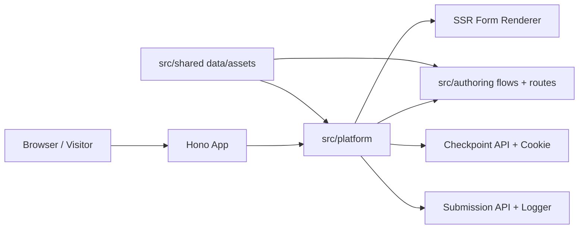

# instant-forms

Ultra-fast Bun + Hono + TypeScript progressive lead forms. The first flow families are Spanish auto and home insurance for Seguros Aseguranza, rendered from authored public route folders such as `/auto/tn` and `/home/tn`.

## Purpose

This repository owns the full local runtime for routed, checkpointed, conversion-focused forms: Hono routes, typed form flows, validation, server-rendered HTML, inline client behavior, tests, and documentation.



## Belongs Here

- Application code under `src/`.
- Fast behavior tests under `tests/unit/`.
- Browser layout and interaction tests under `tests/ui/`.
- Repository-level docs, commands, and contributor guidance.

## Does Not Belong Here

- External CRM, database, or webhook integrations until explicitly introduced.
- Generated build artifacts or downloaded browser binaries.
- Secrets, API keys, or machine-specific local configuration.

## Change Safely

Run the smallest useful check first, then broaden:

```bash
bun run typecheck
bun test
bun run test:ui
git diff --check
```

Use `bun run test:ui:update` only when visual changes are intentional.

## Quickstart

Install dependencies:

```bash
bun install
```

Run the app:

```bash
bun run dev
```

Open `http://localhost:3000/auto/tn`.

Build production form HTML:

```bash
bun run build:forms
```

The build writes minified route HTML into `/_dist/forms`. Each step page still ships CSS and the minimum active-step JavaScript inline for speed, but production requests read the prebuilt shell and only inject the request-specific checkpoint config from the HttpOnly cookie. The build also emits a hashed, cacheable transition JS asset under `/_dist/forms/_instant/forms/<hash>/transition.js`; after the first page settles, the browser loads that static asset so approved next/back transitions can swap step HTML without a full document load. Development keeps readable CSS/JS and uses the same active-step-only SSR shape.

The Hono app applies origin-level text compression with `hono-compress`, preferring Brotli and falling back to gzip for large HTML, JavaScript, JSON, CSS, and plain-text responses. Cloudflare Brotli/compression can remain enabled as an outer edge optimization, but form pages no longer rely on the CDN or Railway edge to satisfy browser compression checks.

## Project Structure

```text
.
├── README.md
├── AGENTS.md
├── index.ts
├── package.json
├── playwright.config.ts
├── src
│   ├── authoring
│   ├── platform
│   └── shared
└── tests
    ├── unit
    └── ui
```

Every source and test folder has its own `README.md` describing ownership and safe-change rules. Diagrams are included only where they clarify architecture or flow.

## Routes

| Route | Purpose |
|---|---|
| `GET /` | Redirects to `/auto/tn`. |
| `GET /auto` | Redirects to the authored Tennessee auto form route at `/auto/tn`. |
| `GET /auto/:state` | Redirects to the next unanswered step for an authored auto state. |
| `GET /auto/:state/:stepSlug` | Renders a guarded routed step for an authored auto state, for example `/auto/tn/vive-en-tennessee`. |
| `GET /auto/*` | Redirects unknown auto group paths back to `/auto/tn`. |
| `GET /home` | Redirects to the authored Tennessee home form route at `/home/tn`. |
| `GET /home/:state` | Redirects to the next unanswered step for an authored home state. |
| `GET /home/:state/:stepSlug` | Renders a guarded routed step for an authored home state, for example `/home/tn/propiedad-en-tennessee`. |
| `GET /home/*` | Redirects unknown home group paths back to `/home/tn`. |
| `GET /__preview/auto/tn/:stepSlug` | No-store preview mirror for public form step visual iteration. |
| `GET /_instant/scripts/:scriptKey.js` | Allowlisted first-party proxy for selected third-party scripts. |
| `GET /~partytown/*` | Partytown worker/runtime assets used after the small bootstrap has been inlined. |
| `POST /api/forms/:routeKey/checkpoints` | Validates one answer, writes the checkpoint cookie, and returns the next URL. |
| `POST /api/forms/:routeKey/submissions` | Validates, posts downstream, and logs completed submissions. |
| `POST /api/forms/:routeKey/native-submissions` | Validates native TrustedForm submissions, posts downstream, and redirects to the authored post-submit page. |

Unavailable public routes use author-controlled title, message, CTA, and status from `src/authoring/routes/registry.ts`.

## Form Flow

Auto- and home-insurance flows are generated from the product-authored area filters in `src/authoring/flows/auto/registry.ts` and `src/authoring/flows/home/registry.ts`. Those filters must use codes from `US_STATES`, but only listed states are mounted under `/auto/{state}` and `/home/{state}`. Both products are built with the typed DSL in `src/platform/flow/dsl/`. Public route placement lives in `src/authoring/routes/registry.ts`. Runtime identity comes from that route mount, so `/auto/tn` uses the encoded route key `auto_tn` and `/home/tn` uses `home_tn`.

Reusable flow shapes live in `src/authoring/templates/` and use `defineFormTemplate(...)`. A template declares a Zod `variables` contract and exposes `.create(input)`, which validates required, optional, and unknown variables before returning a normal `InstantForm` through `defineFormFlow(...)`. Each authored auto state is currently an instantiation of the reusable Spanish auto-insurance template; each authored home state is an instantiation of the reusable Spanish home-insurance template.

Each flow declares a `locale`, an explicit `ui` copy block for platform-owned labels, progress text, modal copy, validation/failure messages, and native error pages, plus a neutral `postSubmit` page for the successful post-submission destination. There is no hidden Spanish fallback: a new language is authored by creating a flow whose step copy, `ui` copy, and `postSubmit` copy are in that language.

Each flow also declares a Zod-backed `contract` with `context`, `answers`, and `payload` schemas. Authored business context such as `areaCode: "TN"`, `areaName: "Tennessee"`, and `product: "auto_insurance"` lives in `context`; answer-producing steps must use keys declared in `contract.answers`; and `payload` declares the downstream HTTPS URL, method, encoding, and a typed `mapping` built from `{ context, answers, submission, request, cookies, browser }`. JSON delivery payloads can contain structured objects, booleans, arrays, and nested data; `form_urlencoded` delivery stays string-only. Valid final submissions are posted to the authored downstream endpoint before the visitor sees success. Supported step kinds are `choice`, `text`, `phone`, `autocomplete`, `interstitial`, and `trusted_form_consent`.

Dynamic authoring is step-level: a step is either static, or it declares one dependency list and one resolver for its dynamic display/body props. Nested field-level `resolve(...)` calls are intentionally rejected so it is always clear which upstream answers a dynamic step needs. Page-level presentation can set a desktop-only form height with `page.presentation.desktopHeightPx`; mobile continues to use the fixed viewport-height layout. Static `presentation.chrome` can hide the form chrome with `"hidden"` or `"hidden_on_mobile"`; TrustedForm substep-specific chrome overrides live under `substeps.review.presentation` or `substeps.consent.presentation`, not inside the dynamic review/consent copy. TrustedForm review and consent prose can use safe Markdown through `md(...)` / `markdown(...)` in that resolver. Submitted values and native controls stay plain text: use `text(...)` for resolver-produced field values and ordinary strings for button labels, placeholders, keys, and slugs. Markdown is rendered on the server with raw HTML escaped, and the browser receives only sanitized HTML in its client config.

Current auto visible order:

1. `belongs_to_state`
2. `residence_state` when `belongs_to_state` is `no`
3. `has_license`
4. `has_insurance`
5. `is_clean_title`
6. `number_of_registered_cars`
7. `matching_offer`
8. `first_name`
9. `last_name`
10. `phone_number`
11. `trustedform_consent`

The `matching_offer` step is routed and checkpointed, but not counted in `Paso X de Y`. Its success copy uses separate colored lines so each phrase can use a distinct brand color.

Current home visible order:

1. `property_in_state`
2. `property_state` when `property_in_state` is `no`
3. `ownership_status`
4. `property_type`
5. `property_use`
6. `has_home_insurance`
7. `house_age_years`
8. `roof_age_years`
9. `matching_offer`
10. `first_name`
11. `last_name`
12. `phone_number`
13. `trustedform_consent`

The `trustedform_consent` step is authored as explicit `review` and `consent` substeps on one route and one native form. `review` owns the confirmation title, optional description, continue label, and ordered field list; fields are tagged for TrustedForm only when the author adds a `trustedForm.role`. `consent` owns the final title, optional description, Markdown disclosure, checkbox label, and submit label. The step executes the TrustedForm Certify SDK only when mounted. Tennessee uses the selected-script proxy at `/_instant/scripts/trustedform.com/tfc.js`, so browsers request the SDK through the first-party domain whether the authored delivery mode is `main_thread` or `partytown`. Transition assets may register the TrustedForm behavior module ahead of time, and the runtime may preload same-origin TrustedForm assets before the consent step, but preloading must not execute Certify or create a certificate. The consent checkbox substep is gated behind TrustedForm readiness.

## Tracking

Flows can opt into Google Tag Manager through the typed `googleTagManager(...)` authoring preset. Templates expose a `gtmContainerId` variable when tracking is enabled, and individual pixel IDs stay inside the GTM container rather than in the form DSL. The browser installs a narrow first-party Google tag request shim, initializes `window.dataLayer`, inlines the tiny Partytown bootstrap, then loads GTM through Partytown and pushes standardized events such as `instant_form_view`, `instant_form_step_view`, `instant_form_step_answer`, validation errors, TrustedForm substep views, and submit attempt/success/error events. GTM preview/debug bootstrap scripts are still first-party proxied, but run on the main thread because Tag Assistant's debug runtime is not reliable inside Partytown. Tracking payloads include safe metadata such as route key, form/page names, step metadata, and explicitly included context keys; answer values are not included by default.

For Meta Pixel testing, set the optional `META_TEST_EVENT_CODE` environment variable before starting the server or building forms. Tennessee passes it through the template as `meta.test_event_code` on authored Meta payloads, so GTM can forward it to Meta Test Events. Leave it unset for normal production traffic. Product/state Meta Pixel IDs are optional and authored beside flow generation in each product registry; add one entry to `autoMetaPixelIds` in `src/authoring/flows/auto/registry.ts` or `homeMetaPixelIds` in `src/authoring/flows/home/registry.ts` to enable Meta events and downstream `meta_conversion` for that product/area.

Auto- and home-insurance flows require `LIDERNA_WEBLEADS_SUBMISSION_URL` before starting the server or building forms. It must be an absolute HTTPS URL and is authored into each template as the blocking downstream lead endpoint.

For Tennessee Meta Conversions API testing or production server-side delivery of progress events, set the optional `META_CONVERSIONS_ACCESS_TOKEN` environment variable before starting the server. When present, the Tennessee template attaches authored server callbacks to its Meta-enabled progress tracking events and sends the same event IDs used by GTM to Meta CAPI. Final `Lead` conversion responsibility is downstream: the submitted delivery payload includes an explicit `meta_conversion` object that the lead processor can use after the lead is processed.

Server-side tracking destinations are composed as explicit authored effects. Meta CAPI and PostHog use the same non-blocking server callback path, so adding a destination does not change the visitor response path. When `POSTHOG_PROJECT_API_KEY` is set, auto and home flows send server-observed funnel events to PostHog's Capture API for step answers, TrustedForm substep views, and submit success. Set `POSTHOG_API_HOST` to override the default `https://us.i.posthog.com`. PostHog events use a shared anonymous visitor id stored in an opaque platform cookie; its lifetime is authored in the flow variables, currently 31,536,000 seconds. The value is a 24-character alphanumeric NanoID and is only created when an authored server tracking effect needs it. PostHog payloads include route, form, step, request URL, IP, user agent, and captured attribution fields, but they do not include raw answers, phone numbers, email, consent text, request cookies, authorization headers, or downstream delivery payloads.

Flows can also declare `attribution` capture hooks for request query parameters that must survive route guards. Tennessee preserves `fbclid`, `source_channel`, `acquisition_channel`, and `platform` through server redirects until a form page can run the authored capture callback. Its `cookies` helper stores Meta's `_fbc` cookie as `fb.1.<timestamp>.<fbclid>` only when the click id is new or missing, and stores bounded first-party attribution cookies for the authored lead payload. After capture, the client may clean the visible step URL as usual.

## Selected Scripts

Selected third-party scripts are declared in `src/authoring/scripts/registry.ts` and served by an allowlisted proxy. The `gtm` entry maps `/_instant/scripts/gtm.js?id=GTM-XXXX&l=dataLayer` to Google Tag Manager. GTM/Google tag follow-up requests are routed through the first-party `/_instant/google-tags/proxy` allowlist by both the Partytown `resolveUrl` hook and a page-level request shim that rewrites main-thread DOM/request escape paths; the shim also exposes decoded upstream URLs to Google tag scripts that inspect their own `src`. The `tfc` entry maps short public query aliases (`f`, `t`, `s`) to the TrustedForm SDK parameters (`field`, `use_tagged_consent`, `sandbox`). Flow templates use `trustedFormCertify(...)` from `src/authoring/integrations/` to reuse the stable Certify field name, proxy URL, preload, execution, and readiness settings without repeating them in every flow. The proxies do not accept arbitrary URLs or forward visitor cookies. Selected script proxy responses use private browser-only caching, while follow-up proxy routes use `no-store`; Cloudflare should also bypass cache for `/_instant/scripts/*`, `/_instant/google-tags/proxy*`, and `/_instant/trustedform/proxy*` if a cache-everything rule is enabled. When Partytown delivery is used, the small `partytown.js` bootstrap is inlined into the page or dynamic initializer; larger worker files are still served from `/~partytown/` after startup. TrustedForm uses the Node fetch runtime because Bun 1.3.9 can hang on the TrustedForm CDN response while Node fetch resolves it normally.

## Checkpoints

Partial answers are saved in an HttpOnly opaque platform cookie with a deterministic `if_<hash>` name, a 7-day max age, `SameSite=Lax`, `Path=/`, and `Secure` on HTTPS. Post-submit state and the shared tracking visitor ID use the same opaque naming strategy. Legacy explicit names such as `instant_forms_<routeKey>_answers`, `instant_forms_<routeKey>_post_submit`, and `instant_forms_visitor_id` are still read during migration, but new writes use only opaque names. Cookie values are base64url JSON and are sanitized before use.

Phone checkpoints preserve the visitor-visible value for resume. Final submissions normalize valid US numbers to E.164, for example `+16155551234`.

## Submissions

The client posts:

```json
{
  "trustedFormCertUrl": "https://cert.trustedform.com/454a35b802f3e7b63ffabb4efedb7c6ebe67886c",
  "answers": {
    "belongs_to_state": "yes",
    "has_license": "yes",
    "has_insurance": "no",
    "is_clean_title": "yes",
    "number_of_registered_cars": "1",
    "first_name": "Ana",
    "last_name": "Lopez",
    "phone_number": "+16155551234",
    "trustedform_consent": "accepted"
  }
}
```

Valid submissions are logged with `routeKey`, form/page names, `submittedAt`, the top-level `trustedFormCertUrl`, the typed delivery payload, and normalized answers. The Tennessee flow can submit without a TrustedForm certificate when `allowSubmitWithoutCert` is true. `matching_offer` is checkpoint-only and omitted from final `answers`; `trustedform_consent` checkpoints as `"accepted"` during the funnel but is stored on final submission as `{ consent: string, trustedform_certificate_url: string | null }`, where `consent` is the server-resolved plain text of the accepted disclosure.

Example logged delivery block:

```json
{
  "delivery": {
    "url": "https://example.test/webleads-v2",
    "method": "POST",
    "encoding": "json",
    "payload": {
      "id": "33333333-3333-4333-8333-333333333333",
      "area": "TN",
      "source_channel": "unknown",
      "acquisition_channel": "organic",
      "ingress_channel": "website",
      "first_name": "Ana",
      "type": "insurance_auto",
      "last_name": "Lopez",
      "phone_number": "+16155551234",
      "created_time": "2026-05-27T12:00:00.000Z",
      "state_code": "TN",
      "is_clean_title": "yes",
      "has_license": "yes",
      "has_insurance": "no",
      "number_of_registered_cars": "1",
      "meta_conversion": {
        "enabled": true,
        "pixel_id": "1465068051587670",
        "event_source_url": "https://dev3000.liderna.net/auto/tn/consentimiento",
        "event_id": "33333333-3333-4333-8333-333333333333",
        "event_name": "Lead",
        "fbp": "fb.1.1779717727926.wqp6t469ygm",
        "fbc": "fb.1.1779717727926.CLICK123"
      }
    }
  }
}
```

## Production Logging

The app emits structured JSON-line logs to stdout through the platform `eventLogger`. Every request receives an `X-Request-Id` response header, and the same `requestId` is included in related route, checkpoint, resolution, tracking callback, submission, and delivery logs.

Lead delivery is the critical production path. Each downstream attempt logs its status or network error, successful delivery logs `lead.delivery_succeeded`, and exhausted retries log `lead.delivery_failed` with `level: "error"` and `critical: true`. Because this project intentionally favors production diagnosis for costly lost-lead failures, successful and failed delivery logs include the normalized answers and full downstream delivery payload. Logs still avoid environment secrets, access tokens, authorization headers, and raw request cookies.

## Contributor Guidance

See `AGENTS.md` for coding-agent and contributor instructions, including instruction precedence, quality gates, and repository conventions.
