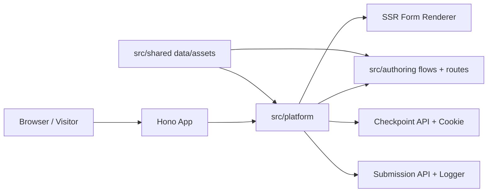

# instant-forms

Ultra-fast Bun + Hono + TypeScript progressive lead forms. The first flow is a Spanish Tennessee auto-insurance form for Seguros Aseguranza, rendered from the authored public route folder `/tn`.

## Purpose

This repository owns the full local runtime for routed, checkpointed, conversion-focused forms: Hono routes, typed form flows, validation, server-rendered HTML, inline client behavior, tests, and documentation.



## Belongs Here

- Application code under `src/`.
- Fast behavior tests under `tests/unit/`.
- Browser layout and interaction tests under `tests/ui/`.
- Repository-level docs, commands, and contributor guidance.

## Does Not Belong Here

- External CRM, database, or webhook integrations until explicitly introduced.
- Generated build artifacts or downloaded browser binaries.
- Secrets, API keys, or machine-specific local configuration.

## Change Safely

Run the smallest useful check first, then broaden:

```bash
bun run typecheck
bun test
bun run test:ui
git diff --check
```

Use `bun run test:ui:update` only when visual changes are intentional.

## Quickstart

Install dependencies:

```bash
bun install
```

Run the app:

```bash
bun run dev
```

Open `http://localhost:3000/tn`.

## Project Structure

```text
.
├── README.md
├── AGENTS.md
├── index.ts
├── package.json
├── playwright.config.ts
├── src
│   ├── authoring
│   ├── platform
│   └── shared
└── tests
    ├── unit
    └── ui
```

Every source and test folder has its own `README.md` describing ownership and safe-change rules. Diagrams are included only where they clarify architecture or flow.

## Routes

| Route | Purpose |
|---|---|
| `GET /` | Redirects to `/tn`. |
| `GET /tn` | Redirects to the authored Tennessee form route at `/tn/custom`. |
| `GET /tn/custom` | Redirects to the next unanswered Tennessee step. |
| `GET /tn/custom/:stepSlug` | Renders a guarded routed step, for example `/tn/custom/vive-en-tennessee`. |
| `GET /tn/*` | Redirects unknown Tennessee group paths back to `/tn/custom`. |
| `GET /__preview/tn/custom/:stepSlug` | No-store preview mirror for public form step visual iteration. |
| `POST /api/forms/:areaCode/checkpoints` | Validates one answer, writes the checkpoint cookie, and returns the next URL. |
| `POST /api/forms/:areaCode/submissions` | Validates and logs completed submissions. |

Unavailable public routes use author-controlled title, message, CTA, and status from `src/authoring/routes/registry.ts`.

## Form Flow

The Tennessee flow lives in `src/authoring/flows/tn/flow.ts` and is built with the typed DSL in `src/platform/flow/dsl/`. Public route placement lives in `src/authoring/routes/registry.ts`, where `/tn/custom` is mapped to the Tennessee flow and `/tn` is a small route group. Supported step kinds are `choice`, `text`, `phone`, `autocomplete`, and `interstitial`.

Current visible order:

1. `belongs_to_state`
2. `residence_state` when `belongs_to_state` is `no`
3. `has_license`
4. `has_insurance`
5. `is_clean_title`
6. `number_of_registered_cars`
7. `matching_offer`
8. `first_name`
9. `last_name`
10. `phone_number`

The `matching_offer` step is routed and checkpointed, but not counted in `Paso X de Y`. Its success copy uses separate colored lines so each phrase can use a distinct brand color.

## Checkpoints

Partial answers are saved in an HttpOnly cookie named `instant_forms_<areaCode>_answers` with a 7-day max age, `SameSite=Lax`, `Path=/`, and `Secure` on HTTPS. Cookie values are base64url JSON and are sanitized before use.

Phone checkpoints preserve the visitor-visible value for resume. Final submissions normalize valid US numbers to E.164, for example `+16155551234`.

## Submissions

The client posts:

```json
{
  "answers": {
    "belongs_to_state": "yes",
    "has_license": "yes",
    "has_insurance": "no",
    "is_clean_title": "yes",
    "number_of_registered_cars": "1",
    "first_name": "Ana",
    "last_name": "Lopez",
    "phone_number": "+16155551234"
  }
}
```

Valid submissions are logged with `areaCode`, form/page metadata, `submittedAt`, and normalized answers. `matching_offer` is checkpoint-only and omitted from final payloads.

## Contributor Guidance

See `AGENTS.md` for coding-agent and contributor instructions, including instruction precedence, quality gates, and repository conventions.
