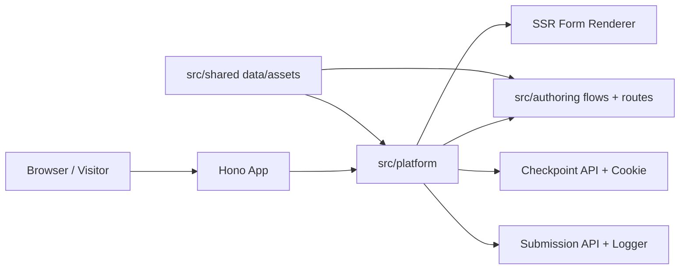

# instant-forms

Ultra-fast Bun + Hono + TypeScript progressive lead forms. The first flow is a Spanish Tennessee auto-insurance form for Seguros Aseguranza, rendered from the authored public route folder `/tn`.

## Purpose

This repository owns the full local runtime for routed, checkpointed, conversion-focused forms: Hono routes, typed form flows, validation, server-rendered HTML, inline client behavior, tests, and documentation.



## Belongs Here

- Application code under `src/`.
- Fast behavior tests under `tests/unit/`.
- Browser layout and interaction tests under `tests/ui/`.
- Repository-level docs, commands, and contributor guidance.

## Does Not Belong Here

- External CRM, database, or webhook integrations until explicitly introduced.
- Generated build artifacts or downloaded browser binaries.
- Secrets, API keys, or machine-specific local configuration.

## Change Safely

Run the smallest useful check first, then broaden:

```bash
bun run typecheck
bun test
bun run test:ui
git diff --check
```

Use `bun run test:ui:update` only when visual changes are intentional.

## Quickstart

Install dependencies:

```bash
bun install
```

Run the app:

```bash
bun run dev
```

Open `http://localhost:3000/tn`.

Build production form HTML:

```bash
bun run build:forms
```

The build writes minified route HTML into `/_dist/forms`. Each step page still ships CSS and the minimum active-step JavaScript inline for speed, but production requests read the prebuilt shell and only inject the request-specific checkpoint config from the HttpOnly cookie. The build also emits a hashed, cacheable transition JS asset under `/_dist/forms/_instant/forms/<hash>/transition.js`; after the first page settles, the browser loads that static asset so approved next/back transitions can swap step HTML without a full document load. Development keeps readable CSS/JS and uses the same active-step-only SSR shape.

## Project Structure

```text
.
├── README.md
├── AGENTS.md
├── index.ts
├── package.json
├── playwright.config.ts
├── src
│   ├── authoring
│   ├── platform
│   └── shared
└── tests
    ├── unit
    └── ui
```

Every source and test folder has its own `README.md` describing ownership and safe-change rules. Diagrams are included only where they clarify architecture or flow.

## Routes

| Route | Purpose |
|---|---|
| `GET /` | Redirects to `/tn`. |
| `GET /tn` | Redirects to the authored Tennessee form route at `/tn/custom`. |
| `GET /tn/custom` | Redirects to the next unanswered Tennessee step. |
| `GET /tn/custom/:stepSlug` | Renders a guarded routed step, for example `/tn/custom/vive-en-tennessee`. |
| `GET /tn/*` | Redirects unknown Tennessee group paths back to `/tn/custom`. |
| `GET /__preview/tn/custom/:stepSlug` | No-store preview mirror for public form step visual iteration. |
| `GET /_instant/scripts/:scriptKey.js` | Allowlisted first-party proxy for selected third-party scripts. |
| `GET /~partytown/*` | Partytown runtime files used by proxied worker-delivered scripts. |
| `POST /api/forms/:routeKey/checkpoints` | Validates one answer, writes the checkpoint cookie, and returns the next URL. |
| `POST /api/forms/:routeKey/submissions` | Validates and logs completed submissions. |

Unavailable public routes use author-controlled title, message, CTA, and status from `src/authoring/routes/registry.ts`.

## Form Flow

The Tennessee flow lives in `src/authoring/flows/tn/flow.ts` and is built with the typed DSL in `src/platform/flow/dsl/`. Public route placement lives in `src/authoring/routes/registry.ts`, where `/tn/custom` is mapped to the Tennessee flow and `/tn` is a small route group. Runtime identity comes from that route mount, so `/tn/custom` uses the encoded route key `tn_custom`.

Reusable flow shapes live in `src/authoring/templates/` and use `defineFormTemplate(...)`. A template declares a Zod `variables` contract and exposes `.create(input)`, which validates required, optional, and unknown variables before returning a normal `InstantForm` through `defineFormFlow(...)`. Tennessee is currently an instantiation of the reusable Spanish auto-insurance template.

Each flow declares a `locale` plus an explicit `ui` copy block for platform-owned labels, progress text, modal copy, validation/failure messages, and native thank-you/error pages. There is no hidden Spanish fallback: a new language is authored by creating a flow whose step copy and `ui` copy are in that language.

Each flow also declares a Zod-backed `contract` with `context`, `answers`, and `payload` schemas. Authored business context such as `areaCode: "TN"`, `areaName: "Tennessee"`, and `product: "auto_insurance"` lives in `context`; answer-producing steps must use keys declared in `contract.answers`; and `payload.mapping` builds a typed delivery payload from `{ context, answers }`. V1 logs that delivery block but does not send it to an external endpoint. Supported step kinds are `choice`, `text`, `phone`, `autocomplete`, `interstitial`, and `trusted_form_consent`.

Dynamic authoring is step-level: a step is either static, or it declares one dependency list and one resolver for its dynamic display/body props. Nested field-level `resolve(...)` calls are intentionally rejected so it is always clear which upstream answers a dynamic step needs. Page-level presentation can set a desktop-only form height with `page.presentation.desktopHeightPx`; mobile continues to use the fixed viewport-height layout. Static `presentation.chrome` can hide the form chrome with `"hidden"` or `"hidden_on_mobile"`; TrustedForm substep-specific chrome overrides live under `substeps.review.presentation` or `substeps.consent.presentation`, not inside the dynamic review/consent copy. TrustedForm review and consent prose can use safe Markdown through `md(...)` / `markdown(...)` in that resolver. Submitted values and native controls stay plain text: use `text(...)` for resolver-produced field values and ordinary strings for button labels, placeholders, keys, and slugs. Markdown is rendered on the server with raw HTML escaped, and the browser receives only sanitized HTML in its client config.

Current visible order:

1. `belongs_to_state`
2. `residence_state` when `belongs_to_state` is `no`
3. `has_license`
4. `has_insurance`
5. `is_clean_title`
6. `number_of_registered_cars`
7. `matching_offer`
8. `first_name`
9. `last_name`
10. `phone_number`
11. `trustedform_consent`

The `matching_offer` step is routed and checkpointed, but not counted in `Paso X de Y`. Its success copy uses separate colored lines so each phrase can use a distinct brand color.

The `trustedform_consent` step is authored as explicit `review` and `consent` substeps on one route and one native form. `review` owns the confirmation title, optional description, continue label, and ordered field list; fields are tagged for TrustedForm only when the author adds a `trustedForm.role`. `consent` owns the final title, optional description, Markdown disclosure, checkbox label, and submit label. The step executes the TrustedForm Certify SDK only when mounted. Tennessee uses the selected-script proxy at `/_instant/scripts/trustedform.com/tfc.js`, so browsers request the SDK through the first-party domain whether the authored delivery mode is `main_thread` or `partytown`. Transition assets may register the TrustedForm behavior module ahead of time, and the runtime may preload same-origin TrustedForm assets before the consent step, but preloading must not execute Certify or create a certificate. The consent checkbox substep is gated behind TrustedForm readiness.

## Tracking

Flows can opt into Google Tag Manager through the typed `googleTagManager(...)` authoring preset. Templates expose a `gtmContainerId` variable when tracking is enabled, and individual pixel IDs stay inside the GTM container rather than in the form DSL. The browser initializes `window.dataLayer` before loading GTM through Partytown and pushes standardized events such as `instant_form_view`, `instant_form_step_view`, `instant_form_step_answer`, validation errors, TrustedForm substep views, and submit attempt/success/error events. Tracking payloads include safe metadata such as route key, form/page names, step metadata, and explicitly included context keys; answer values are not included by default.

## Selected Scripts

Selected third-party scripts are declared in `src/authoring/scripts/registry.ts` and served by an allowlisted proxy. The `gtm` entry maps `/_instant/scripts/gtm.js?id=GTM-XXXX&l=dataLayer` to Google Tag Manager. GTM/Google tag follow-up requests can also be routed through the first-party `/_instant/google-tags/proxy` allowlist used by the Partytown `resolveUrl` hook. The `tfc` entry maps short public query aliases (`f`, `t`, `s`) to the TrustedForm SDK parameters (`field`, `use_tagged_consent`, `sandbox`). Flow templates use `trustedFormCertify(...)` from `src/authoring/integrations/` to reuse the stable Certify field name, proxy URL, preload, execution, and readiness settings without repeating them in every flow. The proxies do not accept arbitrary URLs or forward visitor cookies. TrustedForm uses the Node fetch runtime because Bun 1.3.9 can hang on the TrustedForm CDN response while Node fetch resolves it normally.

## Checkpoints

Partial answers are saved in an HttpOnly cookie named `instant_forms_<routeKey>_answers` with a 7-day max age, `SameSite=Lax`, `Path=/`, and `Secure` on HTTPS. For the current Tennessee mount, that cookie is `instant_forms_tn_custom_answers`. Cookie values are base64url JSON and are sanitized before use.

Phone checkpoints preserve the visitor-visible value for resume. Final submissions normalize valid US numbers to E.164, for example `+16155551234`.

## Submissions

The client posts:

```json
{
  "trustedFormCertUrl": "https://cert.trustedform.com/454a35b802f3e7b63ffabb4efedb7c6ebe67886c",
  "answers": {
    "belongs_to_state": "yes",
    "has_license": "yes",
    "has_insurance": "no",
    "is_clean_title": "yes",
    "number_of_registered_cars": "1",
    "first_name": "Ana",
    "last_name": "Lopez",
    "phone_number": "+16155551234"
  }
}
```

Valid submissions are logged with `routeKey`, form/page names, `submittedAt`, the top-level `trustedFormCertUrl`, the typed delivery payload, and normalized answers. The Tennessee flow can submit without a TrustedForm certificate when `allowSubmitWithoutCert` is true. `matching_offer` and `trustedform_consent` are checkpoint-only and omitted from final `answers`.

Example logged delivery block:

```json
{
  "delivery": {
    "method": "POST",
    "encoding": "json",
    "payload": {
      "marketState": "TN",
      "marketName": "Tennessee",
      "product": "auto_insurance",
      "phone": "+16155551234"
    }
  }
}
```

## Contributor Guidance

See `AGENTS.md` for coding-agent and contributor instructions, including instruction precedence, quality gates, and repository conventions.
