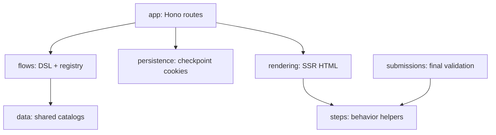

# src

## Purpose

`src/` contains all runtime TypeScript and static assets for the Instant Forms app.

## Belongs Here

- Runtime modules used by the Bun server.
- Source-owned static assets.
- Domain code grouped by app, flow, rendering, persistence, steps, submissions, and data.

## Does Not Belong Here

- Tests, snapshots, build output, or generated docs.
- Runtime secrets or environment-specific files.
- Broad cross-domain utility modules without a clear owner.

## Change Safely

Keep imports flowing through domain entrypoints when possible. If a change crosses folders, update the nearest README and run `bun run typecheck` plus the relevant tests.
