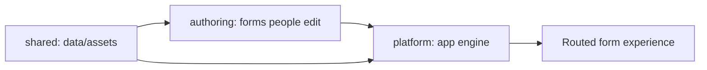

# src

## Purpose

`src/` is organized by change intent: authoring surfaces, platform code, and shared runtime resources.

## Belongs Here

- `authoring/` for market/form content.
- `platform/` for reusable routing, rendering, validation, persistence, and step behavior.
- `shared/` for neutral data and assets consumed across boundaries.

## Does Not Belong Here

- Loose `.ts` files directly under `src`.
- Tests, snapshots, generated output, or secrets.
- New peer folders unless they represent a new top-level change-intent category.

## Change Safely

If a change is mostly copy, questions, or market setup, start in `authoring`. If it changes app capability, start in `platform`. If it is neutral reference data or an asset, use `shared`.
