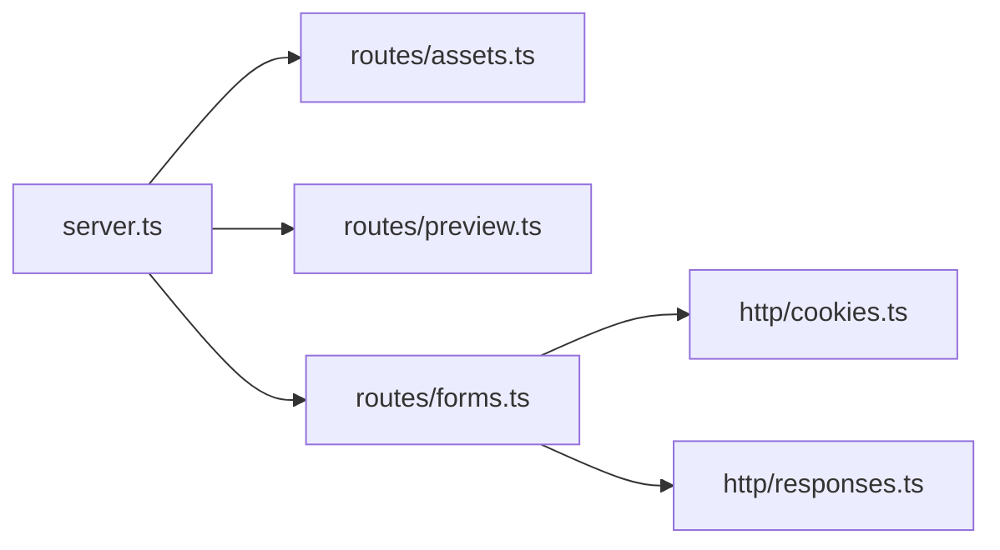

# src/app

## Purpose

`src/app/` owns the Hono application boundary: app creation, route registration, and HTTP concerns.

## Belongs Here

- Hono app setup.
- Route modules.
- HTTP response and cookie helpers.

## Does Not Belong Here

- Form definitions.
- Step validation adapters.
- HTML templates or visual styling.
- Business-specific submission sinks beyond route orchestration.

## Change Safely

Register new routes in `server.ts`, keep route-specific logic in `routes/`, and reuse `http/` helpers for response/cookie behavior.
