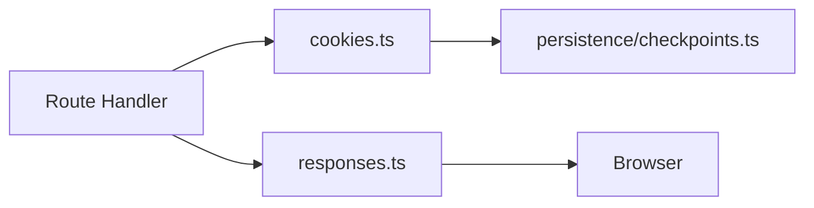

# src/app/http

## Purpose

`src/app/http/` contains small Hono-facing helpers for response creation and checkpoint cookie IO.

## Belongs Here

- Cookie read/write/delete helpers that require Hono context.
- HTML, JSON, redirect, and asset response helpers.
- HTTP cache-control decisions.

## Does Not Belong Here

- Cookie payload validation rules.
- Route branching.
- Form or step definitions.

## Change Safely

Keep helpers thin. If logic can be tested without Hono context, it belongs in `src/persistence/` or another domain folder.
