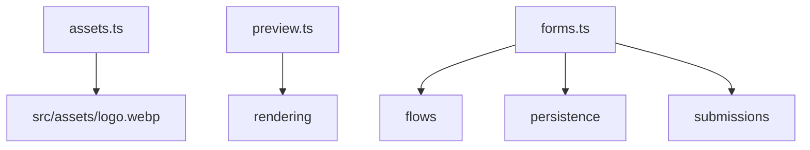

# src/app/routes

## Purpose

`src/app/routes/` owns public HTTP route behavior while delegating validation, rendering, and persistence to domain modules.

## Belongs Here

- URL patterns.
- Guarding and redirect behavior.
- Request body parsing at API boundaries.
- Wiring between app-layer helpers and domain modules.

## Does Not Belong Here

- Step-specific validation branches.
- Inline CSS or client JavaScript.
- Form flow definitions.

## Change Safely

Keep public route changes covered by unit tests. For new route families, add a new route module and register it from `src/app/server.ts`.
