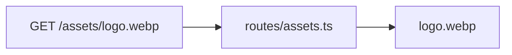

# src/assets

## Purpose

`src/assets/` stores source-owned static assets served by the Bun app.

## Belongs Here

- Small, committed assets required by the form UI.
- Brand images that are served directly by app routes.

## Does Not Belong Here

- Large raw design files.
- Generated screenshots.
- User uploads or runtime files.

## Change Safely

When replacing assets, keep public URLs stable unless the route and rendering code are updated together. Prefer optimized assets to protect page speed.
