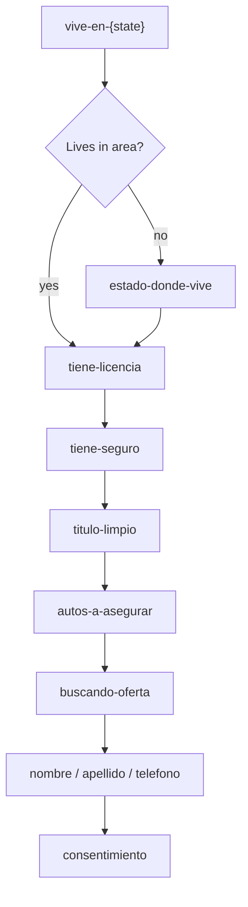

# src/authoring/flows/auto

## Purpose

`src/authoring/flows/auto/` contains the Spanish auto-insurance flow instantiations for every authored area in `US_STATES`.
Each state folder exports one concrete flow mounted at `/auto/{state}` with a route key such as `auto_tn`, `auto_ca`, or `auto_dc`.

## Belongs Here

- One state folder per auto-insurance area, such as `tn/`, `ca/`, and `dc/`.
- `shared.ts` for common template variables such as page name, advertiser name, product, GTM container, and required downstream submission URL.
- `registry.ts` for the explicit state-code-to-flow map consumed by public routes.
- State-specific variables, such as flow name, area code, area name, and optional Meta configuration.

## Does Not Belong Here

- Generic DSL implementation.
- Shared auto-insurance question/copy logic; use `src/authoring/templates/es-auto-insurance/`.
- Runtime route handling.
- Shared reference data such as US state catalogs.

## Change Safely

Keep public slugs stable once launched. New state folders should instantiate the shared Spanish auto-insurance template through `createAutoInsuranceFlow(...)` and be exported from `registry.ts`.
Only add state-specific tracking, pixel, or CAPI settings to the state folder that owns them.
