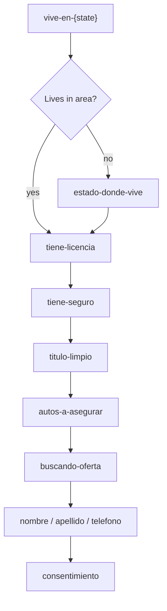

# src/authoring/flows/auto

## Purpose

`src/authoring/flows/auto/` contains the generated Spanish auto-insurance flow family for every authored area in `US_STATES`.
`registry.ts` creates one concrete flow mounted at `/auto/{state}` with a route key such as `auto_tn`, `auto_ca`, or `auto_dc`.

## Belongs Here

- `shared.ts` for common template variables such as page name, advertiser name, product, GTM container, and required downstream submission URL.
- `registry.ts` for the generated state-code-to-flow map consumed by public routes.
- Product/state Meta Pixel IDs declared next to flow generation in `registry.ts`.

## Does Not Belong Here

- Generic DSL implementation.
- Shared auto-insurance question/copy logic; use `src/authoring/templates/es-auto-insurance/`.
- Runtime route handling.
- Shared reference data such as US state catalogs.

## Change Safely

Keep public slugs stable once launched. New state coverage should come from `US_STATES`; do not add per-state auto folders unless a state truly needs a unique flow structure. Add state-specific Meta Pixel IDs to `autoMetaPixelIds` in `registry.ts`.
