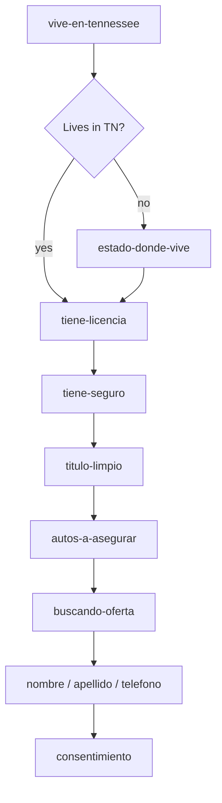

# src/authoring/flows/tn

## Purpose

`src/authoring/flows/tn/` contains the Tennessee Seguros Aseguranza authored form instantiation.

## Belongs Here

- Tennessee template variables such as area, product, page name, and advertiser name.
- Tennessee-specific route-facing flow export.

## Does Not Belong Here

- Generic DSL implementation.
- Validation adapters or phone/autocomplete algorithms.
- Page shell styling.

## Change Safely

Changing order or visibility can affect browser history and checkpoints. Update route and rendering tests with any authored flow change.
The reusable Spanish auto-insurance structure lives in `src/authoring/templates/`; update that template when changing shared questions, copy, or TrustedForm behavior.
