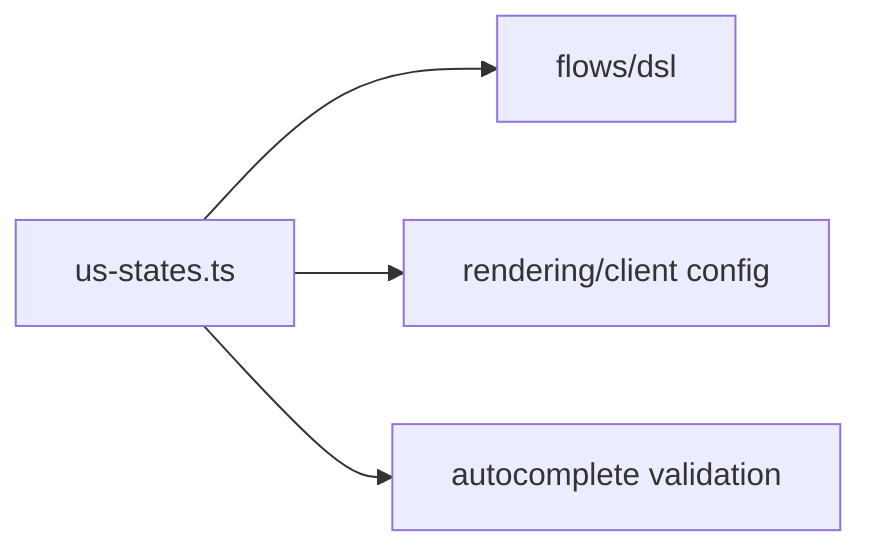

# src/data

## Purpose

`src/data/` contains shared static catalogs that flows and helpers can depend on without creating business logic cycles.

## Belongs Here

- Stable lookup data such as US state names and codes.
- Catalog-level normalization helpers tied directly to that data.

## Does Not Belong Here

- Per-flow question definitions.
- UI rendering code.
- Cookie or submission validation orchestration.

## Change Safely

Update tests when a catalog changes. Normalizers should remain deterministic and dependency-free.
