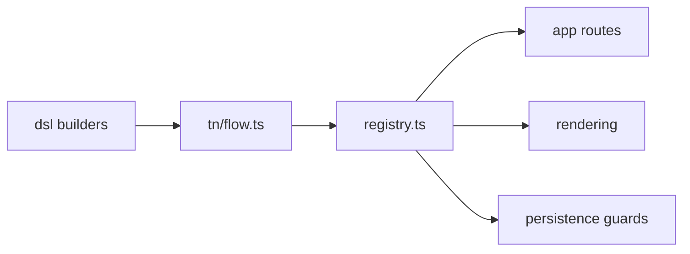

# src/flows

## Purpose

`src/flows/` defines form flows declaratively, registers available area codes, and exposes helpers for routed step lookup.

## Belongs Here

- The form DSL and typed step definitions.
- Area-specific flow files.
- Registry helpers such as URL generation, visible-step checks, and counted-step semantics.

## Does Not Belong Here

- Hono request handlers.
- HTML templates or CSS.
- Low-level phone/autocomplete algorithms.

## Change Safely

Add future markets under their own folder, export them through `registry.ts`, and keep slugs stable once public.
