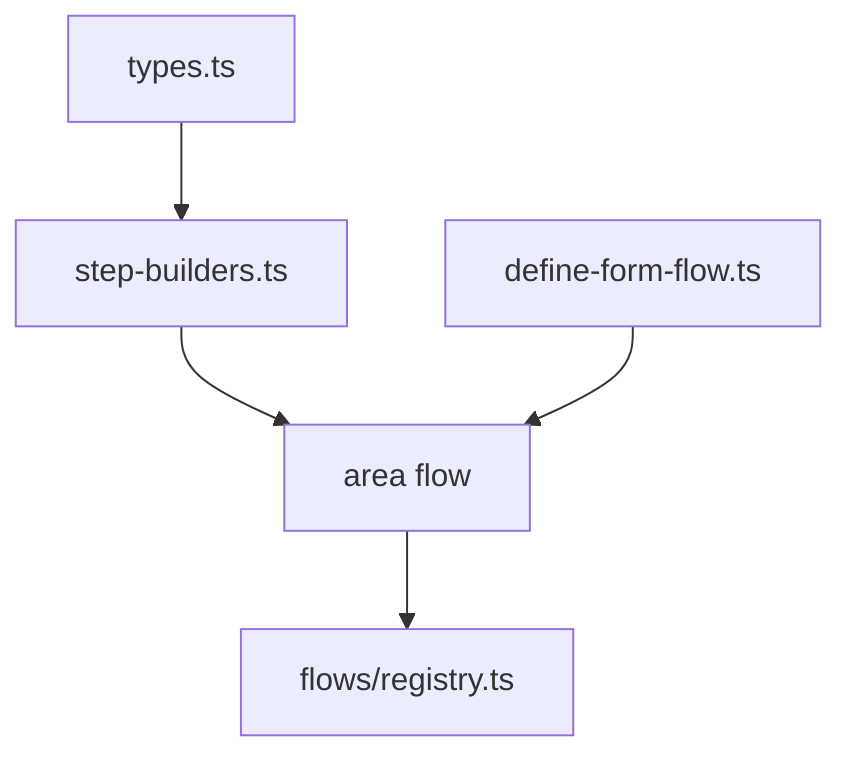

# src/flows/dsl

## Purpose

`src/flows/dsl/` owns the TypeScript-first form definition language used by all area flows.

## Belongs Here

- Shared form and step types.
- Step builders for `choice`, `text`, `phone`, `autocomplete`, and `interstitial`.
- Flow-level normalization such as lowercase `areaCode`.

## Does Not Belong Here

- A specific market's questions.
- Renderer-specific HTML attributes.
- Route guards or cookie code.

## Change Safely

Prefer extending builders over adding ad hoc properties. When adding a step kind, add its type, builder, adapter, renderer contract, and tests together.
