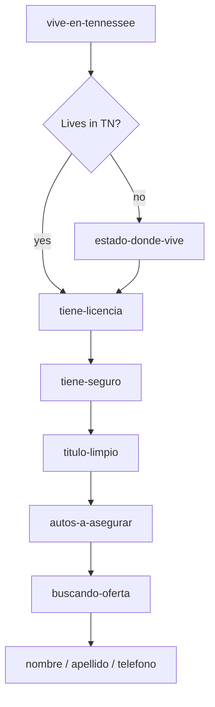

# src/flows/tn

## Purpose

`src/flows/tn/` contains the Tennessee Seguros Aseguranza form flow.

## Belongs Here

- Tennessee metadata, step order, labels, slugs, and conditional visibility.
- Tennessee-specific matching-step copy.

## Does Not Belong Here

- Generic DSL builders.
- Validation algorithms.
- Rendering implementation.

## Change Safely

Changing a slug can break public URLs and screenshots. Add or adjust route tests whenever the flow order, visibility, or copy changes.
