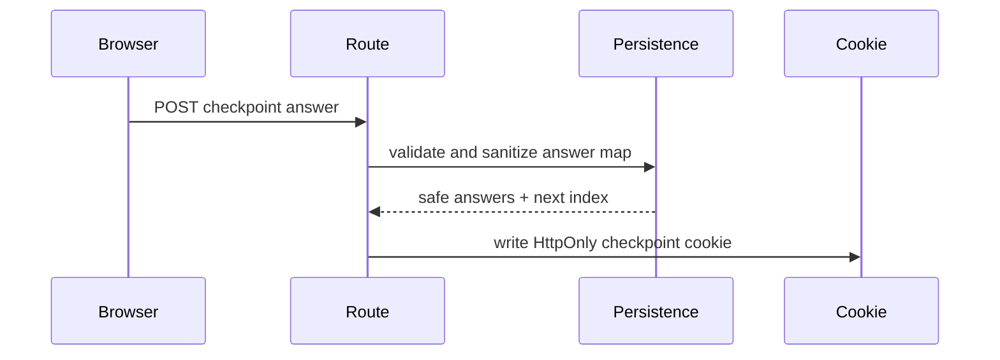

# src/persistence

## Purpose

`src/persistence/` owns checkpoint answer encoding, sanitization, resume logic, and step-access guards.

## Belongs Here

- Base64url checkpoint encoding and decoding.
- Sanitizing cookie answers against the current flow.
- Resume, next-step, and too-forward guard calculations.

## Does Not Belong Here

- Hono cookie header APIs.
- Final submission payload creation.
- UI state or browser history behavior.

## Change Safely

Preserve cookie names and payload compatibility unless a migration is explicitly planned. Add route tests for any guard or resume behavior change.
