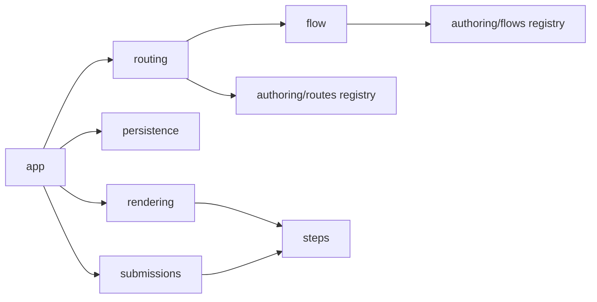

# src/platform

## Purpose

`src/platform/` is the reusable form engine: routing, rendering, checkpointing, validation, flow semantics, and step behavior.

## Belongs Here

- Core features that change how the app works.
- Public form route compilation and defaults.
- Reusable step kinds and behavior helpers.
- Server-rendered page shell and client controller.

## Does Not Belong Here

- Market-specific form content.
- Static shared catalogs or brand assets.
- New authored area folders.

## Change Safely

Platform changes are higher blast radius. Run typecheck, unit tests, UI tests, and update all affected folder READMEs when changing behavior.
