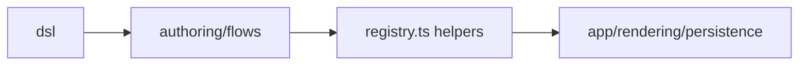

# src/platform/flow

## Purpose

`src/platform/flow/` owns reusable flow semantics: DSL exports, step URL helpers, visibility, counted-step logic, and area lookup.

## Belongs Here

- Flow DSL exports and platform-level flow helper functions.
- Runtime lookup by `areaCode`.
- Step slug, URL, visibility, and counted-step semantics.

## Does Not Belong Here

- Area-specific flow definitions.
- Route handlers or page templates.
- Shared reference data beyond type-level use.

## Change Safely

Runtime modules should import flow behavior from this folder. This folder may load authored flows only through `src/authoring/flows/registry.ts`.
