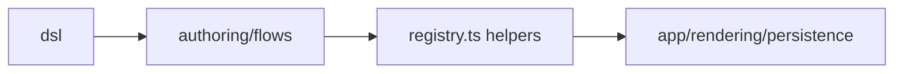

# src/platform/flow

## Purpose

`src/platform/flow/` owns reusable flow semantics: DSL exports, step URL helpers, visibility, and counted-step logic.

## Belongs Here

- Flow DSL exports and platform-level flow helper functions.
- Step slug, fallback URL, visibility, and counted-step semantics.

## Does Not Belong Here

- Area-specific flow definitions.
- Route handlers or page templates.
- Shared reference data beyond type-level use.

## Change Safely

Runtime modules should import flow behavior from this folder. Public placement and route-key lookup belong in `src/platform/routing`, not in the flow DSL.
