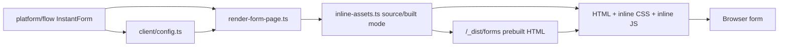

# src/platform/rendering

## Purpose

`src/platform/rendering/` owns server-rendered HTML, inline critical CSS, inline browser behavior, production prebuilt page preparation, and per-step markup contracts.

## Belongs Here

- `renderFormPage` and `renderUnavailablePage`.
- Unavailable-page presentation for content supplied by routing.
- Critical CSS and browser controller delivery.
- Production inline CSS tokenization, selector tokenization, HTML/CSS/JS compaction, and prebuilt page shells.
- Client config generated from the server DSL.
- Template ownership files for each step kind.

## Does Not Belong Here

- Authored form definitions.
- Hono route handlers.
- Server-side validation adapters.

## Change Safely

Rendering changes are layout-sensitive. Run render assertions and Playwright screenshots when adjusting CSS, DOM structure, or client behavior.

Development responses keep readable CSS variables and readable inline controller JS. Production responses still inline everything for speed, but `bun run build:forms` writes minified active-step shells into `/_dist/forms`. Request-time production rendering reads the prebuilt shell and injects only the dynamic form config needed for checkpoint-prefilled answers and route state.
