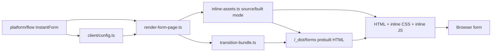

# src/platform/rendering

## Purpose

`src/platform/rendering/` owns server-rendered HTML, inline critical CSS, inline browser behavior, production prebuilt page preparation, and per-step markup contracts.

## Belongs Here

- `renderFormPage` and `renderUnavailablePage`.
- Unavailable-page presentation for content supplied by routing.
- Critical CSS and browser controller delivery.
- Production inline CSS tokenization, selector tokenization, HTML/CSS/JS compaction, and prebuilt page shells.
- Static transition JS asset generation for post-load step swaps.
- Client config generated from the server DSL.
- Template ownership files for each step kind.
- Server-side Markdown rendering for authored display copy. Raw HTML is escaped and only sanitized HTML is sent to the browser.

## Does Not Belong Here

- Authored form definitions.
- Hono route handlers.
- Server-side validation adapters.

## Change Safely

Rendering changes are layout-sensitive. Run render assertions and Playwright screenshots when adjusting CSS, DOM structure, or client behavior.

Development responses keep readable CSS variables and readable inline controller JS. Production responses still inline everything for speed, but `bun run build:forms` writes minified active-step shells into `/_dist/forms`. Request-time production rendering reads the prebuilt shell and injects only the dynamic form config needed for checkpoint-prefilled answers and route state.

For faster transitions, production builds also emit a cacheable transition JS asset with static step HTML, non-PII client metadata, and registered behavior modules. The browser starts loading that asset immediately after the initial step mounts; guarded checkpoint APIs still decide which route is allowed next. TrustedForm-specific code may be registered in that asset, and same-origin TrustedForm assets may be preloaded before the consent step, but Certify execution, Partytown initialization, and certificate polling happen only when the consent step mounts.

When a flow enables Google Tag Manager, rendering owns the head bootstrap: `dataLayer` is created first, Partytown is configured to forward `dataLayer.push`, the first-party GTM script URL is rendered, and safe initial page-view metadata is pushed without answer values.
