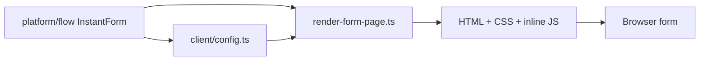

# src/platform/rendering

## Purpose

`src/platform/rendering/` owns server-rendered HTML, inline critical CSS, inline browser behavior, and per-step markup contracts.

## Belongs Here

- `renderFormPage` and `renderUnavailablePage`.
- Unavailable-page presentation for content supplied by routing.
- Critical CSS and browser controller delivery.
- Client config generated from the server DSL.
- Template ownership files for each step kind.

## Does Not Belong Here

- Authored form definitions.
- Hono route handlers.
- Server-side validation adapters.

## Change Safely

Rendering changes are layout-sensitive. Run render assertions and Playwright screenshots when adjusting CSS, DOM structure, or client behavior.
