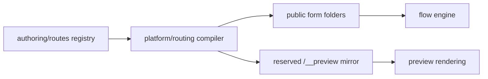

# src/platform/routing

## Purpose

`src/platform/routing/` compiles authored public form route folders into Hono handlers.

## Belongs Here

- The small public route DSL used by authoring.
- Hono registration for form page folders and nested route groups.
- Reserved preview mirror behavior for public form folders.
- Default form-folder fallbacks and authored group-level fallbacks.
- Unavailable-route actions with authored title, message, CTA, and status.

## Does Not Belong Here

- Checkpoint or submission API route definitions.
- Area-specific flow content.
- Step validation, templates, or client-controller behavior.

## Change Safely

Keep this layer focused on URL placement. Flow semantics such as resume, guards, legacy slugs, and interstitial visibility should continue to come from the flow platform.

