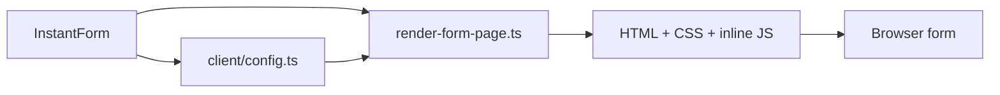

# src/rendering

## Purpose

`src/rendering/` owns server-rendered HTML, inline critical CSS, inline client behavior, and per-step markup contracts.

## Belongs Here

- `renderFormPage` and `renderUnavailablePage`.
- Critical CSS and browser controller delivery.
- Client config generated from the server DSL.
- Template ownership files for each step kind.

## Does Not Belong Here

- Form definitions.
- Route handlers.
- Server-side validation adapters.
- Static catalogs unless needed to serialize client config.

## Change Safely

Rendering changes are layout-sensitive. Run unit render assertions and Playwright screenshots when adjusting CSS, DOM structure, or client controller behavior.
