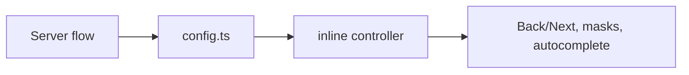

# src/rendering/client

## Purpose

`src/rendering/client/` owns the serialized client contract that lets the browser controller understand the server-defined flow.

## Belongs Here

- Client-facing config shapes.
- Server-to-browser mapping helpers.
- Browser controller ownership markers.

## Does Not Belong Here

- Hono routes.
- CSS-only layout rules.
- Source flow definitions.

## Change Safely

Treat config keys as a browser API. If a field changes, update render tests and any Playwright interaction that depends on it.
