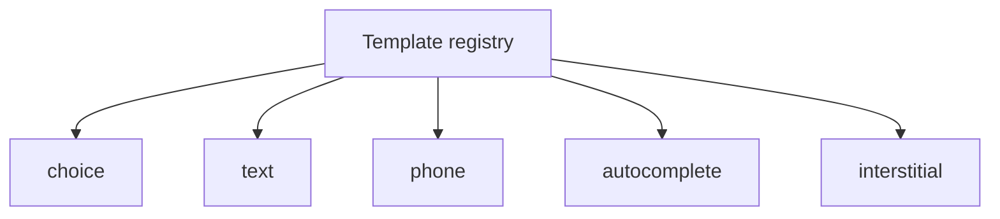

# src/rendering/templates

## Purpose

`src/rendering/templates/` defines ownership boundaries for each step-kind template.

## Belongs Here

- Step-kind markup helpers as the renderer continues to split.
- Template-specific DOM contracts and data attributes.

## Does Not Belong Here

- Client controller logic.
- Validation adapters.
- Area-specific copy.

## Change Safely

Keep `data-*` hooks stable unless tests and client controller logic are updated in the same change.
