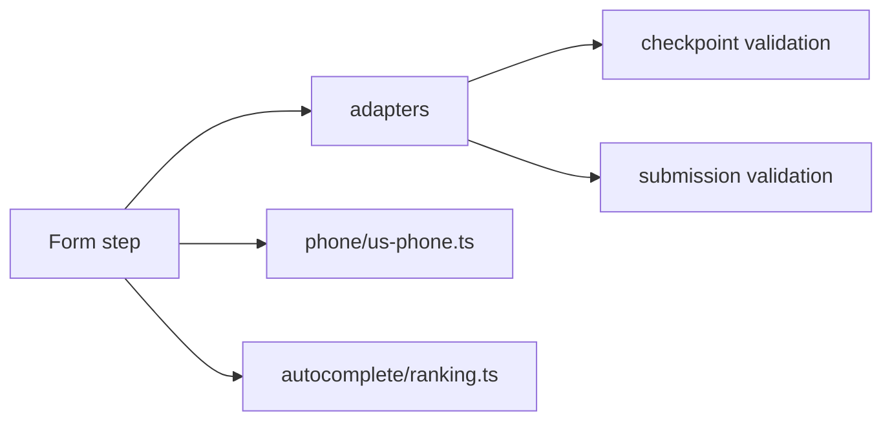

# src/steps

## Purpose

`src/steps/` owns reusable step-kind behavior that is independent of a specific area form.

## Belongs Here

- Step adapters for checkpoint/submission validation.
- Phone normalization.
- Autocomplete ranking algorithms.

## Does Not Belong Here

- Hono routes.
- Area-specific flow files.
- HTML page shell or CSS.

## Change Safely

When changing a step kind, keep its adapter, DSL type, renderer contract, and tests aligned.
