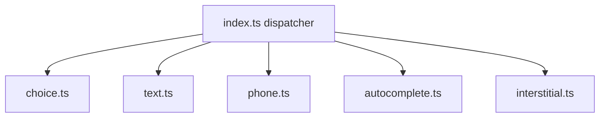

# src/steps/adapters

## Purpose

`src/steps/adapters/` owns server-side behavior for each step kind.

## Belongs Here

- Checkpoint validation per step kind.
- Submission validation and normalization per step kind.
- Answered-state checks.

## Does Not Belong Here

- Client-side masks.
- Route-level guard code.
- Rendering templates.

## Change Safely

Adapters are the server source of truth. Keep error messages stable unless tests and UI copy are intentionally updated.
