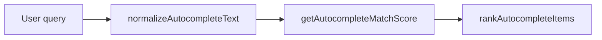

# src/steps/autocomplete

## Purpose

`src/steps/autocomplete/` owns reusable ranking for searchable suggestion steps.

## Belongs Here

- Generic autocomplete item shape.
- Text normalization.
- Ranking and sorting helpers.

## Does Not Belong Here

- DOM suggestion rendering.
- State validation beyond search-term preparation.
- Route or cookie logic.

## Change Safely

Ranking changes are UX-sensitive. Add tests for short queries, exact matches, code matches, and word-start matches.
