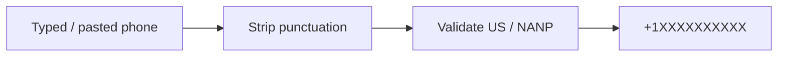

# src/steps/phone

## Purpose

`src/steps/phone/` owns dependency-free US phone normalization rules.

## Belongs Here

- Phone validation messages.
- Server-side phone normalization helpers.

## Does Not Belong Here

- Browser input masking.
- Submission payload assembly.
- International phone support unless added intentionally.

## Change Safely

Keep server normalization stricter than the UI mask. Add accepted and rejected format tests for every phone rule change.
