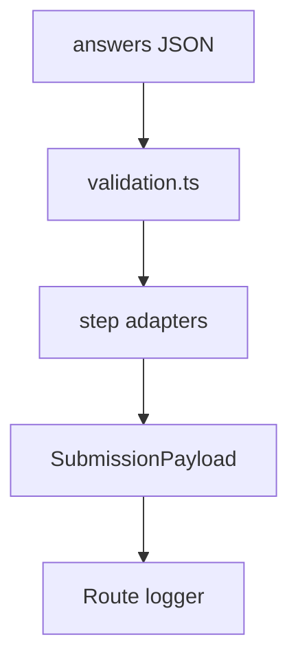

# src/submissions

## Purpose

`src/submissions/` owns final submission validation and payload construction.

## Belongs Here

- Final all-answers validation.
- Normalized submission payload shape.
- Submission-specific exported types.

## Does Not Belong Here

- Checkpoint cookie behavior.
- Hono response handling.
- Browser-side validation or masking.

## Change Safely

Payload shape changes are integration-sensitive. Update README examples, unit tests, and any downstream sink in the same change.
