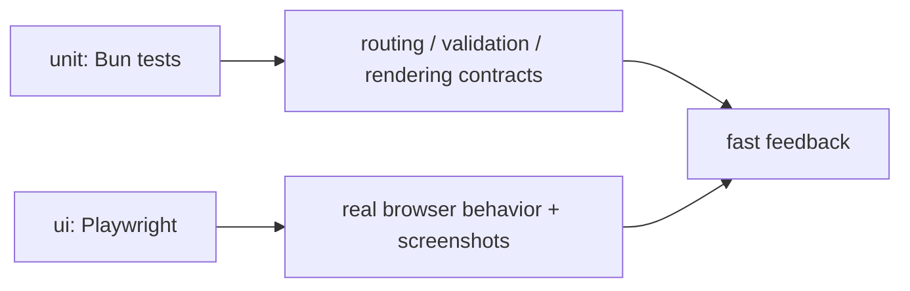

# tests

## Purpose

`tests/` contains behavior and browser coverage for the form system.

## Belongs Here

- Unit tests for TypeScript behavior and generated HTML contracts.
- Playwright tests for browser-visible interactions and layout.
- Snapshot fixtures owned by UI tests.

## Does Not Belong Here

- Runtime source code.
- Generated reports committed by accident.
- External service integration tests without a clear fixture strategy.

## Change Safely

Run `bun test` for logic changes and `bun run test:ui` for browser-visible changes. Snapshot updates must be intentional.
