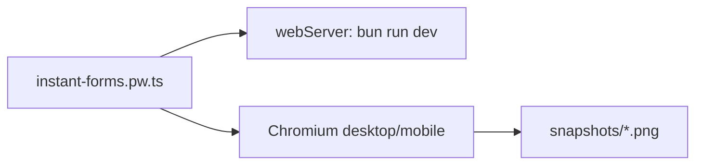

# tests/ui

## Purpose

`tests/ui/` contains Playwright coverage for real browser behavior and stable visual states.

## Belongs Here

- Browser Back/Forward tests.
- Mobile and desktop interaction smoke paths.
- Error modal, phone mask, autocomplete, and screenshot checks.

## Does Not Belong Here

- Pure validation tests.
- Source fixtures unrelated to browser behavior.
- Ad hoc manual screenshots.

## Change Safely

Use deterministic setup with checkpoint cookies. When screenshots fail, inspect the diff before running `bun run test:ui:update`.
