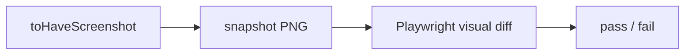

# tests/ui/snapshots

## Purpose

`tests/ui/snapshots/` stores Playwright screenshot baselines for stable UI states.

## Belongs Here

- Committed PNG baselines generated by Playwright.
- A README explaining why the folder exists.

## Does Not Belong Here

- Manual screenshots.
- Temporary diff output.
- Production assets.

## Change Safely

Only update snapshots for intentional visual changes. Keep filenames stable by using the Playwright `snapshotPathTemplate`.
