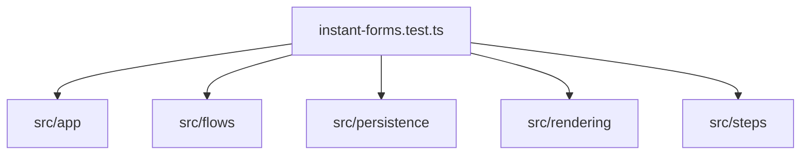

# tests/unit

## Purpose

`tests/unit/` contains fast Bun tests for route behavior, flow compilation, validation, checkpointing, and render contracts.

## Belongs Here

- Deterministic tests that do not need a browser.
- HTML string contract checks for server-rendered markup.
- Structure assertions that protect the folder architecture.

## Does Not Belong Here

- Screenshot assertions.
- Long-running browser flows.
- Tests that require network services.

## Change Safely

Keep tests cheap enough to run often. Prefer direct function calls over spinning up HTTP servers when `createFetchHandler()` is enough.
